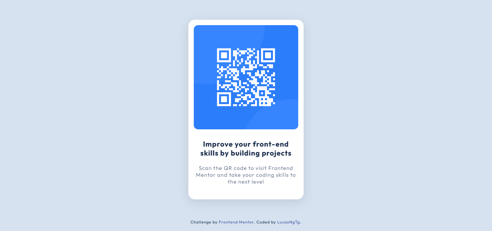
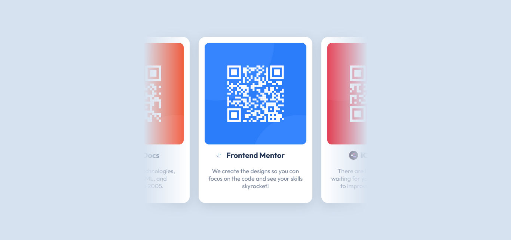

# QR code component solution with infinite scroll

This is a modified version of the solution to the [QR code component challenge on Frontend Mentor](https://www.frontendmentor.io/challenges/qr-code-component-iux_sIO_H).

## Table of contents

- [Overview](#overview)
  - [Screenshot](#screenshot)
  - [Links](#links)
- [Author](#author)

### Screenshot

What it looked like

What it looks like now

### Links

- Solution URL: https://www.frontendmentor.io/solutions/html-and-css-wagOk6GEFU
- Live Site URL: https://lucasngtg.github.io/qr-code-component/

## Author

- Frontend Mentor - [@LucasNgTg](https://www.frontendmentor.io/profile/LucasNgTg)
- GitHub - [@LucasNgTg](https://github.com/LucasNgTg)
