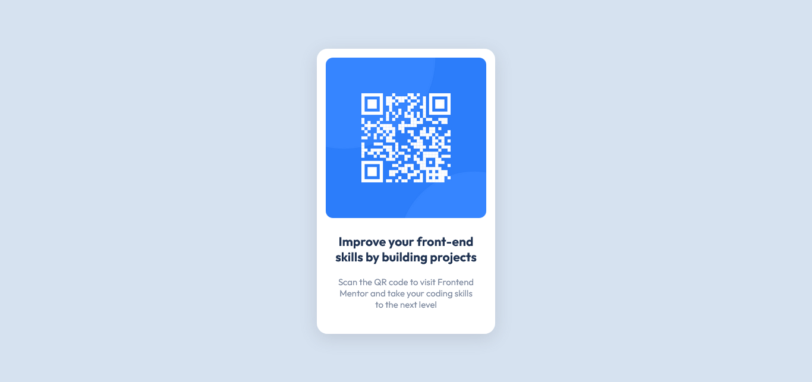

# Frontend Mentor - QR code component solution

This is a solution to the [QR code component challenge on Frontend Mentor](https://www.frontendmentor.io/challenges/qr-code-component-iux_sIO_H). Frontend Mentor challenges help you improve your coding skills by building realistic projects. 

## Table of contents

- [Overview](#overview)
  - [Screenshot](#screenshot)
  - [Links](#links)
  - [Built with](#built-with)
  - [What I learned](#what-i-learned)
  - [Continued development](#continued-development)
  - [Useful resources](#useful-resources)
- [Author](#author)

## Overview

This is my first project on Frontend Mentor.

### Screenshot



### Links

- Solution URL: [Add solution URL here](https://your-solution-url.com)
- Live Site URL: [Add live site URL here](https://your-live-site-url.com)

### Built with

- Visual Studio Code
- HTML
- CSS

### What I learned

The most time consuming part was trying to figure out the style values by eye. 

### Continued development

CSS has a lot of properties that achieve visually similar goals, which made it somewhat challenging to judge which would be best to get the results I wanted. I'll keep working on getting used to them.

### Useful resources

- [Shadow presets](https://getcssscan.com/css-box-shadow-examples) - This saved me time having to create the ```box-shadow``` from scratch.

## Author

- Frontend Mentor - [@LucasNgTg](https://www.frontendmentor.io/profile/LucasNgTg)
- GitHub - [@LucasNgTg](https://github.com/LucasNgTg)
